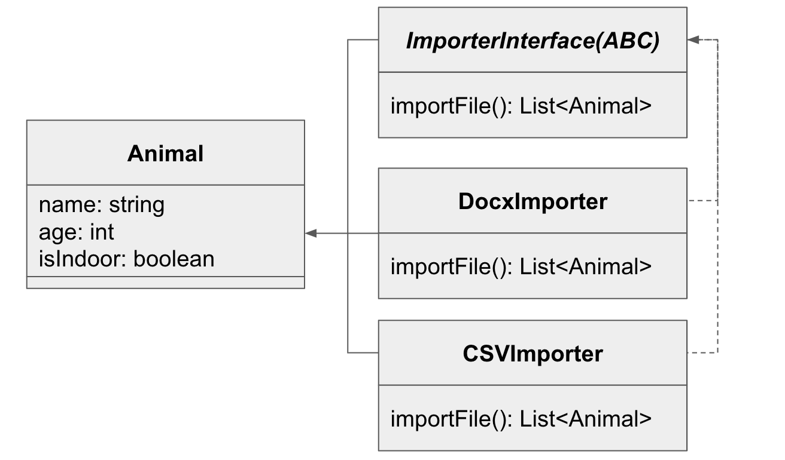

Strategy Object File Importer
=============================

## Goals:

1. to import a list of cats from a variety of complex file types. 
1. to create a simple system to ingest data from different type of files, such as csv, xls, xlsx, txt, docx, pdf.
1. to incorporate a simple interface to dynamically selecting the most appropriate class to Import the files without needing to write additional code. 

### Implementation details:

The abstrat class ImporterInterface implements the can_ingest class method which decides if a file is compatible with the importer.

A parse abstract class method signature, fully complete in the children classes that implement the ImporterInterface.

The Importer class encapsulates the CSVImporter, XlsImporter, XlsxImporter, DocxImporter, TxtImporter, and the PDFImporter classes.

In Figure 1 is presented the class diagrams that describes the implementation of the strategy objects. 



The DocxImporter class is responsible for loading data from Docx (Microsoft Word Document) files, the CSVImporter class is responsible for loading data from CSV (Comma Separated Value) files, and the same idea applies for the file types xls, xlsx, txt, pdf.

### Dependencies: 

1. Before explore the code prepare a virtual environment using Python3.6+. Then proceed to install all the dependencies specified in the file requirements.txt.
1. pdftotext: Converts pdf to text (.pdf to .txt):
    - installation:
        - sudo apt install poppler-utils (Linux)
        - brew install poppler           (MacOS)
    - converts .pdf to .txt:
    ```sh
    $ pdftotext cats.pdf cats.txt
    ```